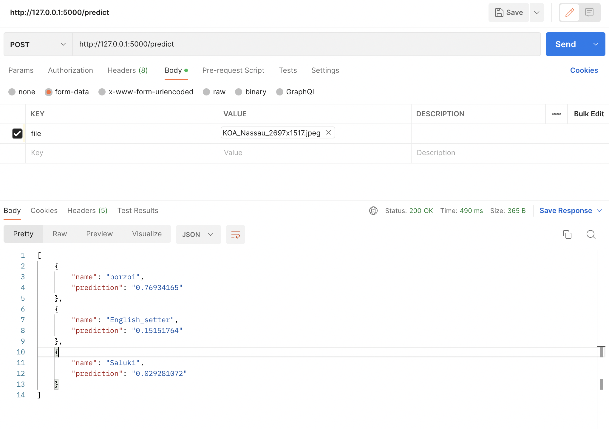

This simple python Flask project serves as a reference for putting your ML app in production. 
I am using **Flask** and pre-trained image classifier model from `Keras`.
Other libraries that are used in the project are `numpy` and `tensorflow`.


## Run project in local in debug mode
```
flask --app ml_app run --debug
```
By default project starts in port `5000`
## Call the API
`/predict` POST api can be called with image to predict the image against the pre-trained model used in this project.

Screenshot below highlights the instructions for same.
 

## build docker image
```
docker build -t ml-app .
```

## Model used

I am using `resnet50` pre-trained model. It can be found [here](https://keras.io/api/applications/resnet/#resnet50-function) 

>Docker file used in project can be hosted in kubernetes, ECS or any other platform which supports containers.


Flask comes with default embedded server but it is not recommended for production. Hence i am using `gunicorn` which is better suited for production environment.

I kept it very much minimalistic, if you think we can add more key things there then please send PR.
